# Consumer Driven Contracts mit Pact
Dieses Beispielprojekt soll die Verwendung von Pact für Consumer Driven Contracts veranschaulichen. 

## Kontext des Beispiels
Das Beispielprojekt sich aus drei Services zusammen, mit denen eine Bestellung von Produkten durchgeführt werden.



Der `order`-Service konsumiert in im Beispiel den `receipts`-Service, um für eine Bestellung eine Rechnung zu erhalten. Der `receipts`-Service bekommt eine Liste der Produkt-IDs sowie einen Rabattcode. Zur Berechnung konsumiert der Service die API des `products`-Services, der alle weiteren Informationen zu den Produkten wie Name und Preis liefert.

Die Services enthalten jeweils Tests, in denen die andere Services, von denen sie abhängen, durch Mocks ersetzt werden. Im "produktiven" Code werden die Services mit Hilfe der Rest-Client-Erweiterung für Quarkus definiert, wie im folgenden Beispiel für den `ReceiptService` im `order`-Projekt:

```java
@Path("/receipts")
@RegisterRestClient(configKey = "receipts-api")
public interface ReceiptService {
    @POST
    @Produces(MediaType.APPLICATION_JSON)
    @Consumes(MediaType.APPLICATION_JSON)
    Receipt calculateReceipt(ReceiptRequest receiptRequest);

}
```

```properties
# Auszug aus der application.properties
quarkus.rest-client."receipts-api".url=http://localhost:8085/api
%test.quarkus.rest-client."receipts-api".url=http://localhost:8095/api
```
